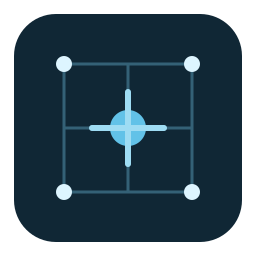

<p align="center">
	
</p>

<h1 align="center">AtomForge</h1>

<p align="center">
	<a href="https://doi.org/10.5281/zenodo.20054535">
		
	</a>
</p>

AtomForge is an interactive atomic structure builder for metallurgical simulation and atomistic modeling. It is designed to help researchers and engineers create, edit, inspect, and export structures used in molecular dynamics (MD) and first-principles workflows.

## Features

- Build structures with bulk crystal, substitutional solid solution, CSL grain boundary, nanocrystal, custom mesh-fill, interface, polycrystal, amorphous, and stacking-fault workflows.
- Create Wulff-style and shape-based nanocrystals, including non-cubic periodic references.
- Merge multiple loaded structures in an interactive 3D workflow with per-structure transforms.
- Analyze structures with CNA, RDF, angular distribution, short-range order, and interstitial/void analysis tools.
- Inspect and edit structures interactively with atom selection, box select, measurement overlays, and structure editing dialogs.
- Export simulation structures and publication-ready rendered images (PNG, JPEG, SVG).
- Use dark/light themes with HiDPI-aware UI scaling.

## Platform support

- Linux
- Windows (MSYS2 UCRT64 / MinGW-w64)

For dependency lists, build commands, portable packaging, and troubleshooting see [INSTALL.md](INSTALL.md).

## Supported formats

Structure files (open/save): `.xyz`, `.cif`, `.pdb`, `.sdf`, `.mol`, `.vasp`, `.mol2`, `.pwi`, `.gjf`

Rendered image export: `.png`, `.jpg`, `.svg`

You can also open a structure at launch by passing a file path, for example:

```bash
AtomForge structure.cif
```

## Command-line interface (CLI)

AtomForge also supports headless structure generation through `--build` modes.

```bash
AtomForge --build <mode> [options] --output <file>
```

Available modes:

- `bulk`: build a bulk crystal from lattice + space-group input
- `gb`: build a CSL grain-boundary bicrystal from an input structure
- `poly`: generate a Voronoi polycrystal from an input structure
- `nano`: carve a nanocrystal from an input structure
- `amorphous`: pack an amorphous structure by random sequential addition
- `sss`: generate a substitutional solid solution from a host structure
- `custom`: fill an OBJ/STL mesh volume with atoms from a reference crystal

Examples:

```bash
AtomForge --build gb --input cu.cif --axis "0 0 1" --sigma 5 --plane 0 --uca 3 --ucb 3 --vacuum 5.0 --output cu_sigma5_gb.cif
AtomForge --build custom --input cu.cif --mesh bunny.obj --scale 20 --vacuum 5 --output cu_bunny.xyz
```

For per-mode help:

```bash
AtomForge --help bulk
AtomForge --help gb
AtomForge --help poly
AtomForge --help nano
AtomForge --help amorphous
AtomForge --help sss
AtomForge --help custom
```

## Python API

AtomForge structures can be loaded, edited, and visualised directly from Python via the [`atomforge-py`](https://pypi.org/project/atomforge-py/) package.

```bash
pip install atomforge-py
pip install "atomforge-py[ase]"   # adds CIF / VASP / PDB / LAMMPS support
```

```python
import atomforge as af

# Load any supported format
s = af.load("crystal.cif")

# Build from scratch
s = af.Structure()
s.set_cell(2.87, 2.87, 2.87)        # BCC iron unit cell (Å)
s.add_atom("Fe", 0.0,   0.0,   0.0)
s.add_atom("Fe", 1.435, 1.435, 1.435)

# Supercell, filter, translate
sup = s.repeat(4, 4, 4)
fe  = sup.filter_species("Fe")
fe.translate(1, 0, 0)

# Open in the AtomForge GUI (non-blocking)
sup.view()

# Save to file
sup.save("bcc_4x4x4.xyz")
```

Set `ATOMFORGE_PATH` to the full path of the AtomForge executable if it is not on your system PATH.

## Core controls

### Scene navigation

| Action | Input |
| --- | --- |
| Rotate scene | Left drag |
| Zoom | Scroll wheel |
| Reset fitted default view | `R` or View -> Reset Default View |

### Selection

| Action | Input |
| --- | --- |
| Select one atom | Left click |
| Add/remove from selection | Ctrl + left click |
| Select all | Ctrl + A |
| Clear selection | Ctrl + D or Escape |
| Delete selection | Delete |

Box selection is available from Edit -> Box Select Mode. When enabled, right-drag draws a selection rectangle. Hold Ctrl to add to current selection.

### File shortcuts

| Action | Shortcut |
| --- | --- |
| Open structure | Ctrl + O |
| Save structure | Ctrl + S |
| Save structure as | Ctrl + Shift + S |
| Export rendered image | Ctrl + Alt + S |
| Undo | Ctrl + Z |
| Redo | Ctrl + Y or Ctrl + Shift + Z |

## Main workflows

### Open and inspect

1. Use File -> Open.
2. Navigate with rotate/zoom controls.
3. Toggle View -> Show Bonds and View -> Show Element as needed.
4. Open View -> Structure Info for composition, lattice, positions, and symmetry.

### Edit structure data

- Right-click a selection to substitute atoms, insert midpoint atoms, measure, or delete.
- Use Edit -> Edit Structure to modify lattice vectors and atom positions.
- Use Edit -> Atomic Sizes and Edit -> Element Colors to adjust visual properties.
- Use Edit -> Transform Structure to apply a 3x3 matrix to periodic structures.
- Use Edit -> Merge Structures to load, arrange, and merge multiple structures in an interactive 3D preview.

### Build structures

- **Bulk Crystal**: Create periodic cells from crystal system, space group, lattice parameters, and asymmetric-unit atoms.
- **Substitutional Solid Solution**: Randomly substitute elements on host lattice sites to match a target composition.
- **CSL Grain Boundary**: Build cubic bicrystals with Sigma, plane, replication, translation, and overlap controls.
- **Nanocrystal**: Carve finite particles using geometric shapes or Wulff-style facet energies.
- **Custom Structure**: Fill imported mesh volumes (OBJ/STL) with atoms from a reference crystal.
- **Polycrystal**: Generate Voronoi-based polycrystalline structures from a reference crystal.
- **Interface Builder**: Match in-plane supercells and build heterogeneous interfaces.
- **Amorphous / Stacking Fault**: Generate amorphous packs and stacking-fault structures.

### Merge structures

- Open **Edit -> Merge Structures** to combine multiple structures into one.
- Drag-and-drop supported structure files while the dialog is open.
- Select individual structures in the list or preview, then use the 3D gizmo for translate/rotate.
- Orbit and zoom the preview, optionally show/hide the merged bounding box, then apply **Merge Structures**.

## Analysis and coloring

### Crystal orientation coloring

- View -> View Structure By -> Crystal Orientation switches from element colors to cubic IPF-Z colors.
- Displays an IPF triangle legend in the main view when active.
- Saves companion `basename.atomforge-ipf` metadata when IPF data is available.
- Restores from sidecar metadata on load when present, with geometry-based fallback otherwise.

### Analysis tools

- Common Neighbour Analysis (CNA)
- Radial Distribution Function (RDF)
- Angular Distribution Function (ADF)
- Short Range Order (SRO)
- Interstitial and void analysis
- Coordination and bonding statistics

## Display and measurement

- Bonds are inferred from covalent radii and rendered as split-color cylinders.
- Periodic image atoms are shown at cell boundaries for periodic context.
- Distance and angle tools draw overlays directly in the scene.
- Atom Info reports element, Cartesian/direct coordinates, and bond statistics.
- View -> Select Theme supports dark and light themes with matching overlay colors.
- UI scales automatically for high-resolution and HiDPI displays.

## Citation

```bibtex
@software{Linda_albert-hzbn_AtomForge_v0_2_0_2026,
author = {Linda, Albert},
doi = {10.5281/zenodo.20054535},
month = may,
title = {{albert-hzbn/AtomForge: v0.2.0}},
url = {https://doi.org/10.5281/zenodo.20054535},
version = {v0.2.0},
year = {2026}
}
```
